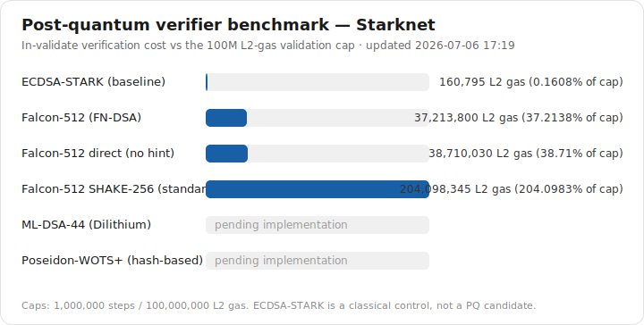

# PQ verifiers for Starknet accounts

[](https://github.com/ericnordelo/pq-verifiers/actions/workflows/efficiency.yml)

_Comparing candidate post quantum signature verifiers for a Starknet account by their
verification cost._

## Why

Starknet's STARK proofs are post quantum. The ECDSA signatures that authorize account
transactions are not, and Shor's algorithm could forge them. Because Starknet accounts are
smart contracts (account abstraction), a post quantum account can ship today by swapping the
check inside `__validate__`, provided that verification fits Starknet's validation limits.
This repo measures which scheme fits, and which does it most efficiently.

## What we measure

For each scheme, the cost of verifying one signature, both alone and inside a real
`__validate__`: L2 gas, Cairo steps, signature and key size, contract class size, and where
the steps go.

Validation is capped at 1,000,000 steps and 100,000,000 L2 gas (blockifier v0.13.4), so a
verifier has to fit under both.

## Snapshot



Current efficiency of every measured entry, per crate (the values pinned in
[`efficiency_baseline.json`](efficiency_baseline.json); caps are 100,000,000 L2 gas and
1,000,000 steps):

| Crate | Measurement | L2 gas | Steps | % of gas cap |
|---|---|--:|--:|--:|
| [`ecdsa_stark`](crates/ecdsa_stark) | verify (classical control) | 30,855 | 152 | 0.03% |
| [`falcon_512`](crates/falcon_512) | verify, hint variant (BLAKE2s) | 35,643,340 | 322,958 | 35.6% |
| [`falcon_512`](crates/falcon_512) | verify, direct variant (BLAKE2s) | 37,190,480 | 340,697 | 37.2% |
| [`falcon_512`](crates/falcon_512) | verify, SHAKE-256 variant (standard) | 202,528,285 | 1,613,066 | 202.5% ⚠ |
| [`bench_targets`](crates/bench_targets) | ECDSA-STARK account, inside `__validate__` | 160,795 | 1,437 | 0.16% |
| [`bench_targets`](crates/bench_targets) | Falcon-512 hint account, inside `__validate__` | 37,213,800 | 337,228 | 37.2% |
| [`bench_targets`](crates/bench_targets) | Falcon-512 direct account, inside `__validate__` | 38,710,030 | 354,481 | 38.7% |
| [`bench_targets`](crates/bench_targets) | Falcon-512 SHAKE-256 account, inside `__validate__` | 204,098,345 | 1,627,331 | 204.1% ⚠ |
| [`ntt`](crates/ntt) | forward 512-point transform | 8,895,740 | 81,826 | 8.9% |
| [`ntt`](crates/ntt) | forward + inverse roundtrip | 22,725,980 | 211,044 | 22.7% |
| [`ml_dsa_44`](crates/ml_dsa_44) | verify | stub — not yet measured | — | — |
| [`poseidon_wots`](crates/poseidon_wots) | verify | stub — not yet measured | — | — |

⚠ exceeds the validation cap — a benchmark target, not deployable as-is (see below).

ECDSA-STARK is the classical scheme in use today, a cost reference rather than a PQ
candidate. Falcon-512 is the first PQ verifier measured, in three variants sharing the same
NTT-domain public key. Two use an on-chain BLAKE2s hash-to-point (a non-standard XOF swap
from SHAKE-256) — **hint** and **direct** — and both fit the validation caps comfortably.
The third, **SHAKE-256**, uses the standard Falcon hash-to-point, so its signatures
interoperate with any compliant Falcon signer; but a software Keccak-f[1600] in pure Cairo
costs ~1.3M steps for hash-to-point alone, pushing verification to ~2× the step cap (⚠
above). It is therefore a benchmark target, not a deployable account — the standard
hash-to-point becomes viable only with a native `keccak_f1600` syscall
([SNIP-32](https://github.com/starknet-io/SNIPs)). All three are validated by genuine
falcon.py-signed fixtures. Their transforms run on the shared lazy-reduction NTT engine
([`crates/ntt`](crates/ntt): felt252 butterflies, at most two reduction passes per
transform); storing the public key in the NTT domain is what keeps either variant at two
transforms. The direct variant carries half the signature calldata (31 vs 60 felts) and
no signer-supplied hint, at a ~4% cost premium (its inverse transform versus the hint's
second forward one). Both also have account contracts measured inside `__validate__`: the
realistic cost sits just above bare verify, because the verifier dominates and the account
overhead (deploy dispatch, reading the 29-slot key, deserialization) is small in relative
terms. The remaining PQ verifiers are scaffolded behind the same interface.

## Report

`make report` regenerates these from the latest run, and the README image updates with it:

```
results/report.html      # rich view: sortable table, charts, profiler attribution
results/report.svg        # the summary image above
results/summary.md        # text summary
results/results.json      # raw data plus metadata
```

## Run

The toolchain is pinned in `.tool-versions` (Scarb 2.18.0, Starknet Foundry 0.59.0,
cairo-profiler 0.16.0). Install it with [asdf](https://asdf-vm.com) or
[starkup](https://github.com/software-mansion/starkup).

```bash
make all        # measure, profile, then render the report
make test       # run the test suite
make check-eff  # efficiency ratchet: fail if any tracked cost regressed
make ratchet    # lock measured improvements into efficiency_baseline.json
```

Efficiency is a one-way ratchet: `efficiency_baseline.json` pins the cost of every
tracked benchmark pair (L2 gas and steps), CI fails any change that raises a number,
and improvements are committed via `make ratchet`.

## Schemes

| Crate | Scheme | Family | Standardization |
|---|---|---|---|
| [`ecdsa_stark`](crates/ecdsa_stark) | ECDSA-STARK | classical EC (control) | none |
| [`falcon_512`](crates/falcon_512) | Falcon-512 (FN-DSA), hint + direct (BLAKE2s) + SHAKE-256 variants | lattice (NTRU) | draft, FIPS 206 (BLAKE2s swap; plus standard SHAKE-256) |
| [`ml_dsa_44`](crates/ml_dsa_44) | ML-DSA-44 (Dilithium) | lattice (module) | final, FIPS 204 |
| [`poseidon_wots`](crates/poseidon_wots) | Poseidon-WOTS+ | hashing | not standardized |

## Method

Every scheme implements the one interface in
[`crates/bench_interface`](crates/bench_interface), and each cost is isolated by
subtracting a baseline test (same inputs, no verify call) from the measured one. Bare
verify covers the function alone. The validate scenario deploys an account mock from
[`crates/bench_targets`](crates/bench_targets) and calls it, which adds dispatch,
signature deserialization, and a storage read. Numbers come from Starknet Foundry (gas,
steps, builtins), a release build (class size), and cairo-profiler (attribution by
function).

## Layout

```
crates/
  bench_interface/   # the common PqSignatureVerifier interface plus cap constants
  ecdsa_stark/       # one crate per scheme (see each crate's README)
  falcon_512/
  ml_dsa_44/
  poseidon_wots/
  ntt/               # shared lazy-reduction NTT engine (used by the lattice schemes)
  bench_targets/     # one account contract per verifier, for the validate scenario
scripts/             # run_bench.py, profile.py, gen_report.py, check_efficiency.py
schemes.json         # the scheme registry
efficiency_baseline.json  # the efficiency ratchet (CI-enforced)
results/             # generated report plus committed snapshot
```

Adding a scheme is documented in [`AGENTS.md`](AGENTS.md).

## References

- Falcon / FN-DSA: [spec](https://falcon-sign.info/falcon.pdf) ·
  [NIST PQC](https://csrc.nist.gov/projects/post-quantum-cryptography)
- [ML-DSA / FIPS 204](https://nvlpubs.nist.gov/nistpubs/fips/nist.fips.204.pdf) ·
  [SLH-DSA / FIPS 205](https://nvlpubs.nist.gov/nistpubs/fips/nist.fips.205.pdf)
- Reference Falcon wallet on Starknet: [s2morrow](https://github.com/feltroidprime/s2morrow)
- Starknet [fees](https://docs.starknet.io/learn/protocol/fees) ·
  [accounts](https://docs.starknet.io/learn/protocol/accounts)

## License

MIT. See [LICENSE](LICENSE).
